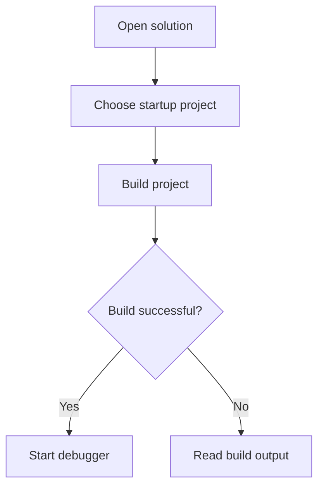
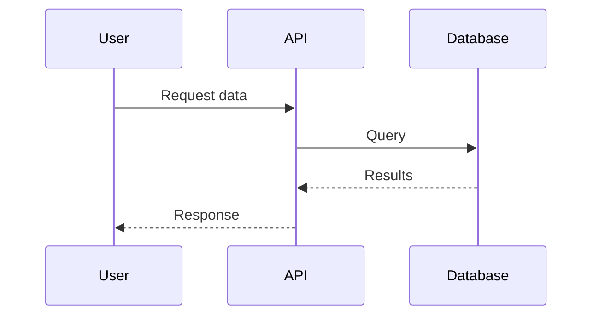

# Markdown preview

Open this file in Neovim. Use **Space mr** to toggle rendering, **Space ms**
for an editor preview split, and **Space mp** to see diagrams in your browser.

## Tasks

- [x] Read Markdown
- [ ] Preview a Mermaid chart

| Feature | In Neovim | Browser preview |
|---|---|---|
| Headings and tables | Yes | Yes |
| Mermaid diagrams | Source code | Rendered diagram |
| Mathematics | Source code | Typeset formula |

## Mermaid flowchart



## Mermaid sequence diagram



## C# code

```csharp
Console.WriteLine("Hello from .NET!");
```

## Mathematics

$$E = mc^2$$
